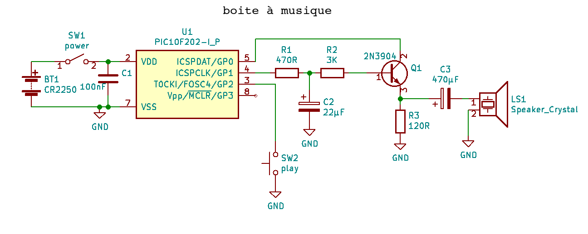
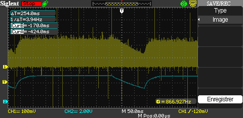

Boite à musique
===============

Une boite à musique réalisée avec un µC  PIC10F202 et quelques composants.

Description
-----------

 Le PIC10f202 est le plus simple et limité des µC. Comme périphérique il ne possède qu'une minuterie de 8 bits. Donc presque tout doit-être fait en logiciel.
La minuterie est utilisée pour contrôler la fréquence de la note. La durée de la note ainsi que la durée du soutenu de la note sont contrôlées par des compteurs
logiciels de 24 bits avec une résolution de 8µSec. 

Le PIC10F202 possède seulement 512 octets de mémoire flash. De plus les appels de sous-routines sont limités aux adresse 0 à 256. Cette limitation impose 2 contraintes
au projet. La première est que toutes les tables de données doivent-être située entre les adresses 0 et 255.  Les entrées de sous-routines doivent aussi être situées
dans l'espace d'adressage entre 0 et 255. Ce qui m'a obligé à utiliser un artifice pour placer les sous-routines après l'adresse 255. L'instruction **GOTO** est là seule qui permet de couvrir les 512 mots d'adressage. Donc je place les entrées de sous-routines dans la page 0 mais ces entrées ne contiennent qu'un **GOTO** vers le vrai 
code de la sous-routine qui est après l'adresse 256. Ceci permet de conserver l'espace de la page 0 pour les tables de données. 

Considérant la mémoire flash limitée du PIC10F202, il n'y a que 4 mélodies d'enregistrées dans la mémoire du µC. Celle-ci sont jouée une après l'autre en boucle à chaque pression du bouton **SW2**. Après chaque mélodie le µC entre en mode **SLEEP** et ne se réveille que lorsqu'on pèse sur le bouton **SW2** pour jouer la mélodie suivante. 

En mode **SLEEP** le PIC10F202 consomme moins de 1µA de sorte que le commutateur d'alimentation **SW1** est facultatif.

Circuit
-------

 La sortie **GP0** est utilisée pour la tonalité. Ce signal audio est envoyé au collecteur du transistor **Q1** qui fonctionne comme un amplificateur en base commune avec la sortie sur l'émetteur qui alimente un petit haut-parleur de 135 ohm. Le gain est contrôlé par la polarisation de la base qui dépend du voltage aux bornes du condensateur **C2**. Donc en faisant varier ce voltage on fait varier l'amplitude du signal audio.

Au début de la note la sortie **GP1** est mise à **Vdd** pour charger **C2** à travers **R3**.  Lorsque le délais de soutenance de la note est expiré. la sortie **GP1** est mise en haute impédance et cesse donc de garder la charge sur **C2**. Donc le condensateur commence à se décharger à travers **R4** et la base de **Q1**. Le gain 
du transistor diminue en même temps que le voltage aux bornes de **C2** et ainsi le signal audio. On a donc un signal audio qui monte et descent progressivement plutôt que de débuter et terminer brutalement ce qui est plus plaisant pour l'oreille.

La LED sur **GP2** suis le signal sur **GP1** elle s'allume donc au rythme de la musique.

Le bouton **SW2** permet de faire jouer la mélodie suivante.

Sur cette capture d'écran de l'oscilloscope on aperçoit en bleu la forme du voltage sur **C2** et en jaune le voltage aux bornes du haut-parleur.

